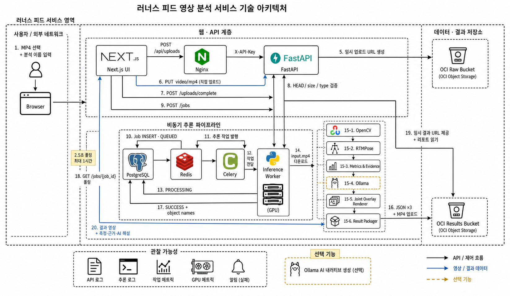

# Runners Eye Showcase

러닝 영상을 자세 데이터로 변환하고 측정값과 개선 피드백을 제공하는 **Runners Feed(Runners Eye)** 팀 프로젝트의 발표자료와 시연 기록입니다.

> Oracle 부트캠프에서 진행한 팀 프로젝트입니다. 최종 앱과 발표자료는 팀 공동 결과물이며, 이 저장소에서는 박주환이 담당한 영상 분석 파이프라인 실험과 GPU 비동기 서버 구현을 함께 설명합니다.

## Public Materials

| 자료 | 설명 |
|---|---|
| [최종 발표자료 PDF](docs/runners-eye-final-presentation.pdf) | 팀 공동 발표자료 16페이지 |
| 서비스 시연 영상 | 1분 45초 편집본을 GitHub Release에 연결 예정 |
| [발표 예상 질문](anticipated-questions.md) | 프로젝트 발표 준비 과정에서 정리한 질문과 답변 |
| [최종 팀 저장소](https://github.com/Temu-F4/Runners_Feed) | 앱, API, 모델과 운영 인프라를 통합한 팀 저장소 |

## Project Overview

사용자가 측면에서 촬영한 러닝 영상을 업로드하면 포즈 추정 모델이 관절 좌표를 추출합니다. 서비스는 자세 특성값을 계산하고 측정 근거와 개선 행동을 리포트로 제공합니다.

## My Contributions

### 2D 자세 피처 검토

- 논문에서 사용한 러닝 생체역학 지표를 측면 2D 영상과 Halpe-26 좌표로 계산할 수 있는지 검토했습니다.
- 별도 장비가 필요한 지면반력, 관절 모멘트와 대사량은 영상 기반 측정 범위에서 제외했습니다.
- 연구 참고값은 의료 진단 기준이 아닌 비교용 정보로 구분했습니다.

### 영상 처리 성능과 결과 차이 검증

- PNG와 JPEG 품질 95의 프레임 저장시간, 용량과 포즈 좌표 차이를 비교했습니다.
- OCI CPU와 RunPod GPU의 업로드, 추론, 렌더링, 인코딩과 다운로드를 포함한 왕복 처리시간을 측정했습니다.
- 속도와 함께 CPU·GPU 결과 차이, 입력 영상 수와 인코딩 조건의 한계를 기록했습니다.

### RunPod 비동기 분석 서버 구현

- OCI와 RunPod 사이의 Object Storage 기반 입력·산출물 전달 구조를 구현했습니다.
- 작업 등록, 상태 polling, 중복 추론 방지와 작업 상태 보존 기능을 추가했습니다.
- 모델 release, checksum과 결과 manifest를 이용해 산출물을 추적할 수 있도록 했습니다.
- 구현과 운영 수정 사항을 팀 저장소의 PR로 반영했습니다.

## Measured Results

| 검증 항목 | 기존 방식 | 변경 방식 | 관측 결과 |
|---|---:|---:|---:|
| 프레임 저장시간 | PNG 17.69초 | JPEG 품질 95 3.07초 | 82.6% 단축 |
| 저장용량 | PNG 902MB | JPEG 품질 95 186MB | 79.4% 감소 |
| 255프레임 처리 | OCI CPU 16.876초 | RunPod GPU 왕복 8.773초 | 48.01% 단축 |
| 631프레임 처리 | OCI CPU 83.351초 | RunPod GPU 왕복 17.461초 | 79.05% 단축 |

위 결과는 프로젝트에서 사용한 제한된 시험 영상과 실행 환경에서 측정했습니다. 모든 입력 영상과 GPU 환경에서 같은 결과를 보장하지 않습니다.

## Evidence

- [CPU·GPU 성능 검증 저장소](https://github.com/RunnersFeed-Project-Oracle-boot-camp/CPU-GPU-Speed-Compare-by-RunPod)
- [PNG·JPEG 품질 및 성능 검증 저장소](https://github.com/RunnersFeed-Project-Oracle-boot-camp/PNG-vs-JPEG-Rendering-Performance-and-FPS-Comparison)
- [Running Pose Feature Prototype 2](https://github.com/RunnersFeed-Project-Oracle-boot-camp/running-pose-feature-prototype2)
- [PR #23 · RunPod video analysis dispatch pipeline](https://github.com/Temu-F4/Runners_Feed/pull/23)
- [PR #24 · RunPod proxy User-Agent 수정](https://github.com/Temu-F4/Runners_Feed/pull/24)
- [PR #25 · GPU 계약 UUID 직렬화 수정](https://github.com/Temu-F4/Runners_Feed/pull/25)
- [PR #26 · systemd 동기화와 배포 디스크 보호](https://github.com/Temu-F4/Runners_Feed/pull/26)
- [PR #34 · 비동기 RunPod 서버 재구현 및 main 병합](https://github.com/Temu-F4/Runners_Feed/pull/34)

## Scope

- 서비스는 의료 진단이나 부상 예측을 제공하지 않습니다.
- 카메라 각도, 가림, 모션 블러와 화면 진입·퇴장 구간이 결과에 영향을 줄 수 있습니다.
- 최종 앱, API, 모델과 운영 인프라 전체는 팀 공동 결과입니다.
- 발표자료는 팀 공동 산출물이며 개인 단독 작성물이 아닙니다.

